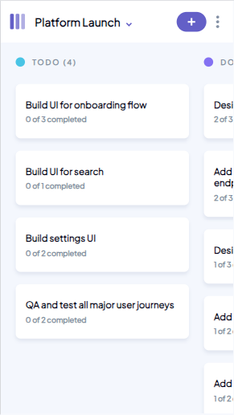
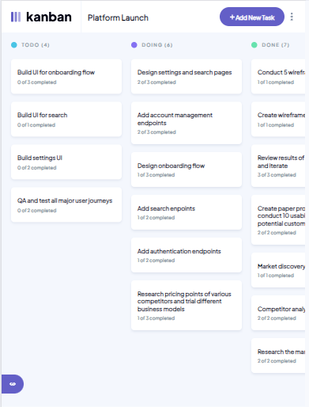
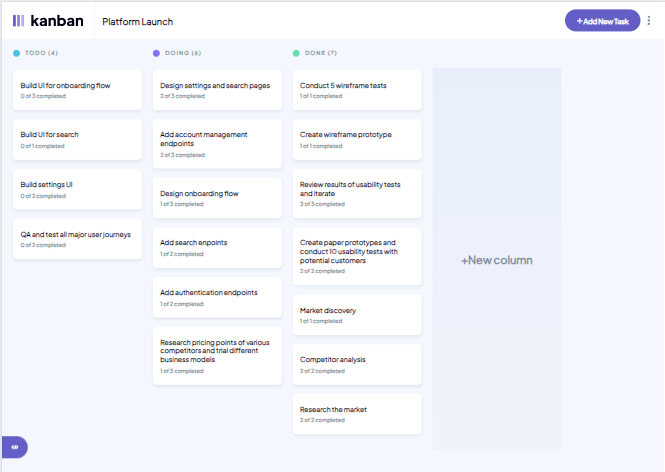

# Frontend Mentor - Kanban task management web app solution

This is a solution to the [Kanban task management web app challenge on Frontend Mentor](https://www.frontendmentor.io/challenges/kanban-task-management-web-app-wgQLt-HlbB). Frontend Mentor challenges help you improve your coding skills by building realistic projects. 

## Table of contents

- [Overview](#overview)
  - [The challenge](#the-challenge)
  - [Screenshot](#screenshot)
  - [Links](#links)
- [My process](#my-process)
  - [Built with](#built-with)
  - [What I learned](#what-i-learned)
  - [Continued development](#continued-development)
  - [Useful resources](#useful-resources)
- [Author](#author)
- [Acknowledgments](#acknowledgments)

## Overview

### The challenge

Users should be able to:

- View the optimal layout for the app depending on their device's screen size
- See hover states for all interactive elements on the page
- Create, read, update, and delete boards and tasks
- Receive form validations when trying to create/edit boards and tasks
- Mark subtasks as complete and move tasks between columns
- Hide/show the board sidebar
- Toggle the theme between light/dark modes
- **Bonus**: Allow users to drag and drop tasks to change their status and re-order them in a column
- **Bonus**: Keep track of any changes, even after refreshing the browser (`localStorage` could be used for this if you're not building out a full-stack app)
- **Bonus**: Build this project as a full-stack application

### Screenshot

### Links

- Solution URL: [GitHub](https://github.com/JimAxl1/Kanban-task-management-web-app)
- Live Site URL: [Link](https://kanban-task-web-app.web.app/)

## My process

### Built with

- Semantic HTML5 markup
- [Sass](https://sass-lang.com/)
- CSS module
- Mobile-first workflow
- [React](https://reactjs.org/) - JS library
- [React redux](https://react-redux.js.org/)
- [React Hook Form](https://www.react-hook-form.com/)
- [Firebase](https://firebase.google.com/)

### What I learned

I learn redux toolkit and other functions of react-hook-form

### Continued development

I would like to improve in code, be a better developer and learn more tools about frontend.

### Useful resources
This websites helped me to solve some problems during the development, I wrote the problems I had with the development of code in the browser and these were the pages I used the most

- [Stack Overflow](https://stackoverflow.com/)
- [Developer mozilla](https://developer.mozilla.org/)
- [Chat GPT](https://chat.openai.com/)

## Author

- Frontend Mentor - [@JimAxl1](https://www.frontendmentor.io/profile/JimAxl1)
- Github - [@JimAxl1](https://github.com/JimAxl1)

## Acknowledgments

Coffe, people of StackOverflow and ChatGPT
